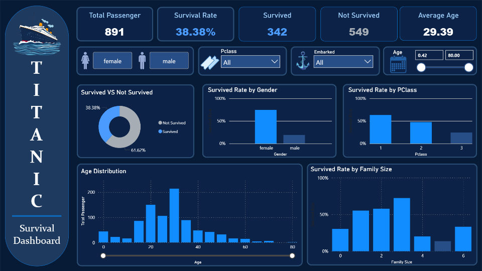

# Titanic Survival Analysis 🚢 | Python Portfolio Project

This project analyze titanic passenger using python and builds predictive models. The projects include Exploratory Data Analysis (EDA), feature engineering, machine learning, and interactive dashboard.

## Reports

## Dataset
Titanic
[Kaggle](https://www.kaggle.com/competitions/titanic/data?select=test.csv)

## Tools

* Python
* Pandas
* NumPy
* Matplotlib
* Seaborn
* Scikit-learn
* Power BI

## Dataset Overview
**Dataset Description**

The data has been split into two groups:

*   training set (train.csv)
    
    Training set used to build machine learning models.

*   test set (test.csv)

    Test set used to see how well the model performs on unseen data to predict whether survived or not in the sinking of the Titanic

Data Dictionary

1. Passenger ID
2. Survived   
   - 0 = No
   - 1 = Yes
3. Pclass (Ticket class)
   - 1 = 1st (Upper)
   - 2 = 2nd (Middle)
   - 3 = 3rd (Lower)
4. Sex
   - Male
   - Female
5. Age (in years)   
   Age is fractional if less than 1. If the age is estimated, is it in the form of xx.5
6. Sibsp (# of siblings / spouses aboard the Titanic)
   - Sibling = brother, sister, stepbrother, stepsister
   - Spouse = husband, wife (mistresses and fiancés were ignored)
7. Parch (# of parents / children aboard the Titanic)
   - Parent = mother, father
   - Child = daughter, son, stepdaughter, stepson
   - Some children travelled only with a nanny, therefore parch=0 for them.
8. Ticket (Ticket Number)
9. Fare (Passenger Fare)
10. Cabin (Cabin Number)
11. Embarked (Port of Embarkation)
    - C = Cherbourgh
    - Q = Queenstown
    - S = Southampton

## Data Preprocessing

- Handling missing values
- Feature engineering:
  - Title extraction from name
  - Family size 
- Encoding categorical variables
- Feature scaling for selected models

## Exploratory Data Analysis (EDA)

- Survival Distribution
- Survival Analysis
  - Survival by gender
  - Survival by passenger class
  - Survival by age
  - Survival by embarked
  - Survival by family size

## Key Findings
- The number of **male** passenger have a **lower survival rate** with **18.9%** while for **female** passenger is **74.2%**
- **Most passengers** are in **Pclass 3**. But the **surival rate is lower** than **Pclass 1**.
- **Children** had a relatively **higher survival rate**, suggesting that **younger** passengers may have had a **higher survival chance**
- **Most** of the passengers boarder from **Embarked Southampton**, but the **survival rate is low**.
- **Survival rate** suggest that passengers with **small families** (1-3 members) tended to have **better survival rate**

## Machine Learning Models

Models evaluated:

- Logistic Regression
- Decision Tree
- Random Forest
- Support Vector Machine (SVM)
- XGBoost

Model Performance (Model Accuracy):
- Logistic Regression	84.3%
- Decision Tree	83.8%
- Random Forest	82.5%
- SVM	86.1%
- XGBoost	86.1%

Best performing model:

**XGBoost**

XGBoost was selected because it achieved the highest overall performance with balanced Accuracy, Recall, F1-score, and AUC-ROC values. It also reduced false negative predictions compared to other models.
